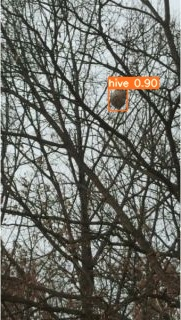

# 在蜂巢检测（私人）数据集上进行YOLOv5轻量化改进

代码是在这个仓库[ultralytics/yolov5-5.0](https://github.com/ultralytics/yolov5). 基础上进行添加、修改的

本项目适合用在一类/几类的数据集上

对YOLOv5原理不了解的，可以看下我的YOLOv5源码注释:[HuKai97/yolov5-5.x-annotations](https://github.com/HuKai97/yolov5-5.x-annotations).和我写的YOLOv5源码讲解：[【YOLOV5-5.x 源码讲解】整体项目文件导航](https://blog.csdn.net/qq_38253797/article/details/119043919).

参考仓库:[ppogg/YOLOv5-Lite](https://github.com/ppogg/YOLOv5-Lite).

## 一、改进依据（ShuffleNetV2 轻量化模型设计的四条准则）：
G1. 卷积层的输入特征channel和输出特征channel要尽量相等；   
G2. 尽量不要使用组卷积，或者组卷积g尽量小；    
G3. 网络分支要尽量少，避免并行结构；   
G4. Element-Wise的操作要尽量少，如：ReLU、ADD、逐点卷积等；

## 二、改进点：
1. backbone的Focus替换为一个3x3Conv（c=32），因为v5-6.0就替换为了一个6x6Conv，这里为了进一步降低参数量，替换为3x3Conv；
2. backbone所有Conv和C3替换为Shuffle Block；
3. 砍掉SPP和后面的一个C3结构，SPP并行操作太多了（G3）
4. head所有层输入输出channel=96（G1）
5. head所有C3改为DWConv
6. PAN的两个Concat改为ADD（channel太大，计算量太大，虽然违反了G4，但是计算量更小）

## 三、CSDN源码关键部分讲解
1. [【YOLOV5-5.x 源码讲解】整体项目文件导航](https://blog.csdn.net/qq_38253797/article/details/119043919)      
2. [【项目二、蜂巢检测项目】一、串讲各类经典的卷积网络：InceptionV1-V4、ResNetV1-V2、MobileNetV1-V3、ShuffleNetV1-V2、ResNeXt、Xception】](https://blog.csdn.net/qq_38253797/article/details/124836049)         
3. [【项目二、蜂巢检测项目】二、模型改进：YOLOv5s-ShuffleNetV2](https://blog.csdn.net/qq_38253797/article/details/124803531)         
   

## 四、代码使用
同YOLOv5

预训练权重文件(领取密码：hk97)   
1. [YOLOv5s(COCO)](https://pan.baidu.com/s/1K1AVoYj-rLigQ0XgPz-wFg).   
2. [YOLOv5s-hive](https://pan.baidu.com/s/1Tz5lLTbyQcPfifR4VKxctw).    
3. [YOLOv5s-shuffleNetv2(COCO)](https://pan.baidu.com/s/14r1FRiiJ5IXXODin3mpdkg).   
4. [YOLOv5s-shuffleNetv2-hive](https://pan.baidu.com/s/1uNyiBEUrv5a-7GtVvYpmTw).    

## 五、训练效果
模型 |YOLOv5s  | YOLOv5s-ShuffleNetV2
-------- |-------- | -----
shape| 320x320 |   320x320
参数量| 6.75M  |   0.69M
FLOPs| 2.05G |  0.32G
权重文件大小| 13.6M|  1.6M
mAP@0.5  |  0.967 |  0.955
mAP@0.5~0.95  | 0.885  |  0.84

(左图yolov5s,右图yolov5s-shufflenetv2)   

## Reference
[ultralytics/yolov5](https://github.com/ultralytics/yolov5)
[ppogg/YOLOv5-Lite](https://github.com/ppogg/YOLOv5-Lite).
